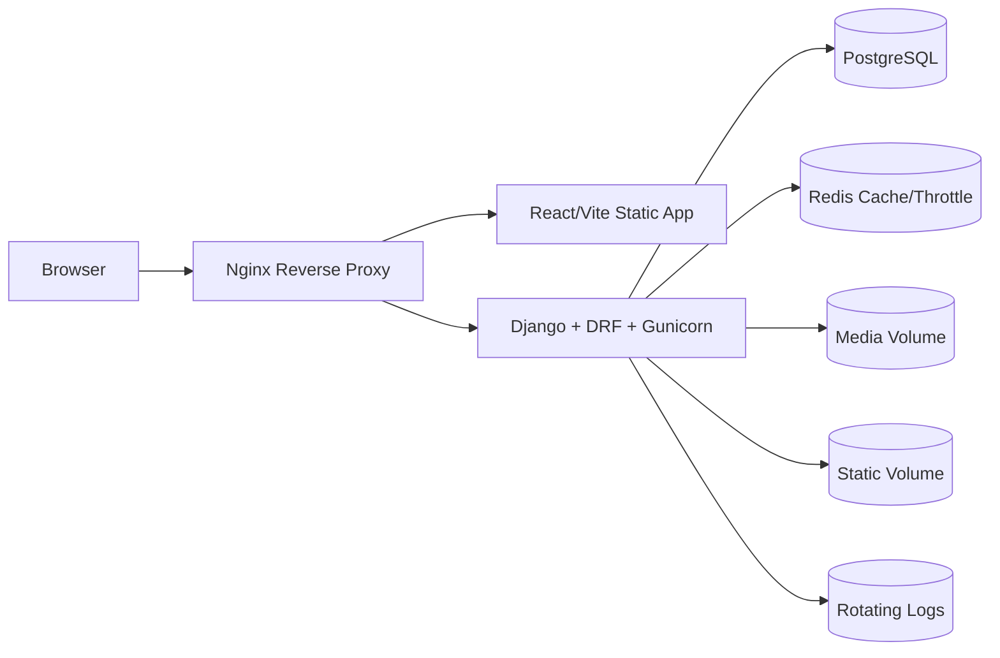

# Architecture Diagram

```mermaid
flowchart LR
    User[Browser] --> Nginx[Nginx Reverse Proxy]
    Nginx --> Frontend[React/Vite Static App]
    Nginx --> Backend[Django + DRF + Gunicorn]
    Backend --> Postgres[(PostgreSQL)]
    Backend --> Redis[(Redis Cache/Throttle)]
    Backend --> Media[(Media Volume)]
    Backend --> Static[(Static Volume)]
    Backend --> Logs[(Rotating Logs)]
```
